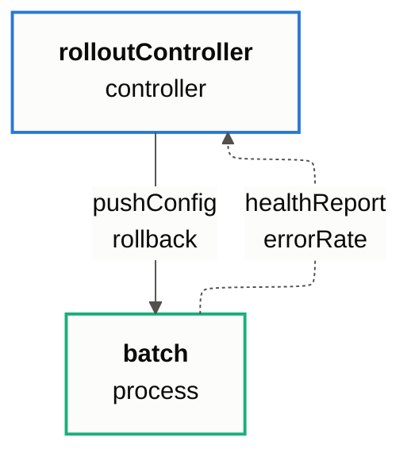

# Control structure: rolloutSystem

Generated by `tools/control_structure.py` from the SysML v2 model. Do not edit by hand.

Solid arrows are control actions, dotted arrows are feedback. Box outlines: blue for controllers, orange for actuators and sensors, green for controlled processes.

The diagram needs Mermaid's ELK layout. In VS Code, view it with the Markdown Preview Mermaid Support extension (bierner.markdown-mermaid). The Mermaid Chart extension may put feedback on the wrong side, and renderers without ELK draw sensors above the controllers they feed.
